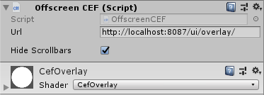

# expload-unity-overlay-sample
This sample shows how to use Expload platform overlay in Unity application.

For now this overlay renders Expload transaction confirmation dialog.
## How it works
It consists of CEF(Chromium Embedded Framework) instance that draws page that hosts by expload desktop app and located at http://localhost:8087/ui/overlay/ address by default.

Page is drawn in Off-Screen Rendering mode to pixel buffer. [OffscreenCEF.cs](Cef/OffscreenCEF.cs), [OffscreenCEFClient.cs](Cef/OffscreenCEFClient.cs)

It has special `transparency` overlay color, that is clipped in [CefOverlay.shader](Assets/Shaders/CefOverlay.shader). For now it is Green (0,1,0,1).

## Usage
For adding expload overlay to your Unity game project:
1. Clone this repo.
2. Copy `Assets\Cef`, `Assets\Editor`, `Assets\Materials`, `Assets\Plugins`, `Assets\Shaders` folders to Unity project.
3. Add full screen RawImage UI to the canvas at the top of scene for rendering Expload overlay.
4. Uncheck `Raycast Target` for allowing mouse clicks to go through RawImage to the game objects.
5. Set `CefOverlay` as Material and `Offscreen CEF` as Script.

5. Make sure that Expload Desktop app is running with logged in user and this user has enough Expcoins to make transfer.
6. Build And Run your game.
7. Run transaction. Both Expload Desktop app and your game should show transaction confirmation dialogs.

Feel free to ask me any question https://t.me/Vovabe https://github.com/vberezkin/
