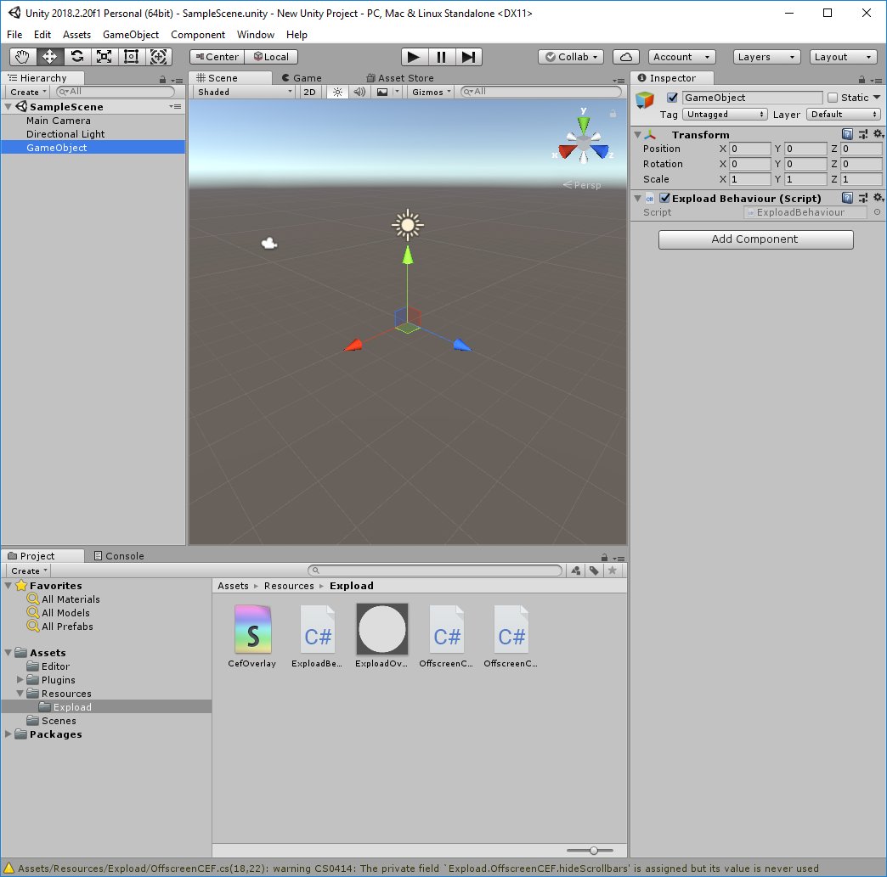

# expload-unity-overlay-sample
This sample shows how to use Expload platform overlay in Unity application.

For now this overlay renders Expload dialogs (transaction confirmation for example).
## How it works
It consists of CEF(Chromium Embedded Framework) instance that draws page that hosts by expload desktop app and located at http://localhost:8087/ui/overlay/ address by default.

Page is drawn in Off-Screen Rendering mode to pixel buffer. [OffscreenCEF.cs](Assets/Resources/Expload/OffscreenCEF.cs), [OffscreenCEFClient.cs](Assets/Resources/Expload/OffscreenCEFClient.cs)

It has special `transparency` overlay color, that is clipped in [CefOverlay.shader](Assets/Resources/Expload/CefOverlay.shader). For now it is Green (0,1,0,1).

## Usage
For adding expload overlay to your Unity game project:
1. Download [expload.unitypackage](https://github.com/expload/expload-unity-overlay-sample/releases)
1. Add downloaded package expload.unitypackage: `Assets` -> `Import package` -> Select expload.unitypackage
2. Add empty object to your game initial scene and set `Expload Behaviour` as `Script`.

That's all.
Now run `Expload Desktop` app and after that run your game.

**Please note**: CEF does not work inside IDE, run game via `File` -> `Build And Run`

Feel free to ask me any question https://t.me/Vovabe
